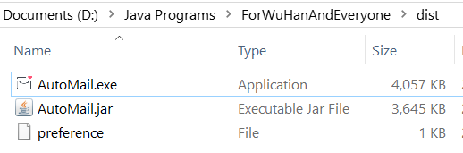

# 简体中文 | [English](./README_EN.md)

## 自动抓取程序

**开发语言:&nbsp; &nbsp;Java**  
**主要功能:&nbsp; &nbsp;在指定时间间隔内抓取疫情数据，并发送到邮箱**  
**数据来源:&nbsp; &nbsp;[2019新型冠状病毒疫情实时爬虫](https://github.com/BlankerL/DXY-2019-nCoV-Crawler) [丁香园](https://3g.dxy.cn/newh5/view/pneumonia)**  
**配置文件说明:**  
软件的正常运行依赖于配置文件preference,该文件说明如下:  
  
hostMail=*******@qq.com 发件箱的邮箱地址，目前仅支持qq邮箱  
authorizationCode=******** 发件箱的授权码，***注意不是邮箱密码***  
mailLists=********@qq.com;lsldragon@outlook.com; 支持多方发送，多个邮箱间以英文分号隔开  
intervalTime=1 间隔时间(单位小时，整数类型)

### 
dist文件夹为编译过的程序，建议在服务器或网络环境良好的计算机中运行(均需JRE才能运行).  
反馈邮箱: lsldragon@outlook.com  
Python版: [Python版](https://github.com/lsldragon/ForWHPython)

## 致谢
祝大家一切都好